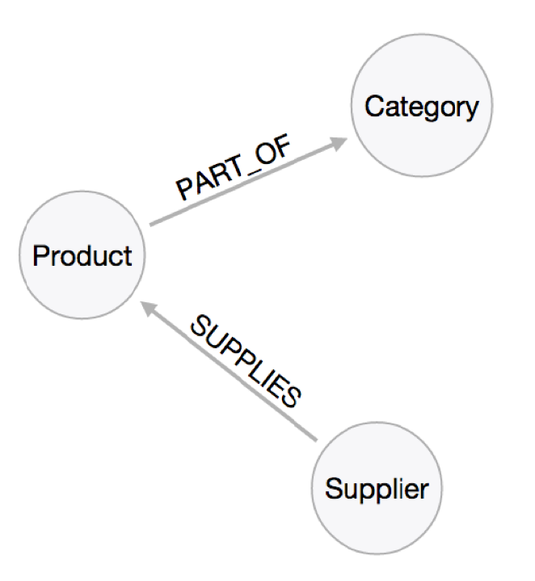

# Fake Server

A Json sales database with REST api



## Instalation

```
$ git clone https://github.com/danielschmitz/fake-server.git

$ cd fake-server
~/fake-server $ npm install
~/fake-server $ npm start
```

Check the message: `JSON Server is running at 3000`

Open your browser and go to: http://localhost:3000/categories


The console shows the Request:


## API operations

All HTTP Rest operations are exposed

```
GET    /categories
GET    /categories/1
POST   /categories
PUT    /categories/1
PATCH  /categories/1
DELETE /categories/1
```

## Filter

Use ? fo filter

```

GET /categories?name=Condiments
GET /categories?id=1&id=2
GET /comments?author.name=typicode
```

## Pagination

```
GET /categories?_page=7
GET /categories?_page=7&_limit=20
```

## Sort

```
GET /categories?_sort=name&_order=asc
GET /categories/1/comments?_sort=votes&_order=asc
```

## Full Text Search

```
GET /categories?q=Sweet
```


## Rest Client (VSCode extension)

Install [Rest Client extension](https://marketplace.visualstudio.com/items?itemName=humao.rest-client) and open file `api.http`. Click at `Send Request` button to see categories. Make your REST calls.

